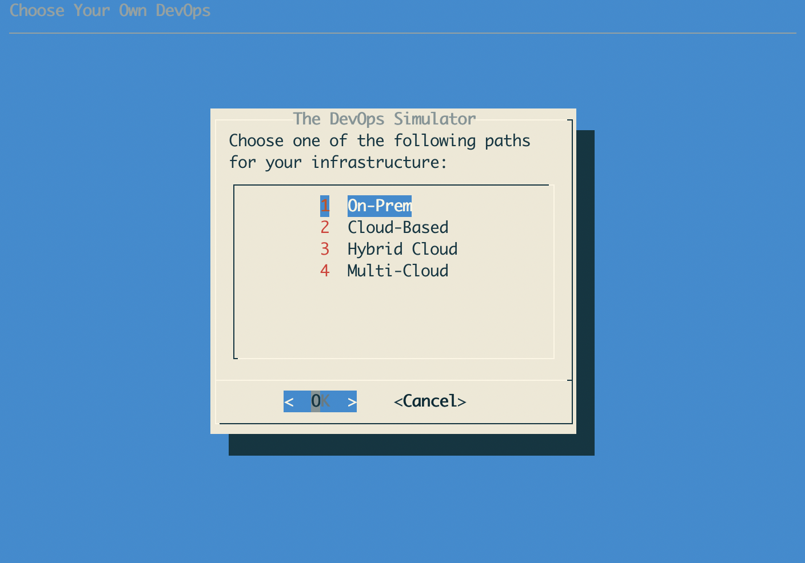

# Choose Your Own DevOps
A menu-driven game that walks you through a form setting up some infrastructure
decisions based on previous answers.  

## Visual "Style"
In the interest of simply getting the idea out there, but at the same time to put some constraints on something
in the works for a few years, a TUI was chosen.



## Pre-Requisites
The only thing you will need is a form of [`dialog`](https://invisible-island.net/dialog/dialog.html) installed. For example, the 
shell version on Ubuntu:

```bash
sudo apt install -y dialog
```

> Note: Dialog is typically installed on most Linux distros by default, though `xdialog` and `kdialog` are also options. `gdialog` (Zenity) appears to be just different enough to not be usable without a port. On macOS, `brew install dialog` will suffice.
